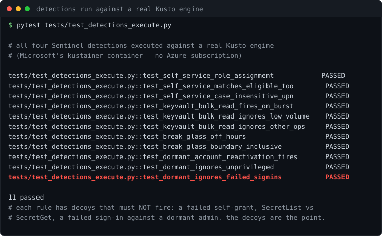

# Lab 04: Privileged Access Detections for Microsoft Sentinel

<p align="center"></p>


[](https://github.com/ChromeData/Sentinel-Privileged-Access/actions/workflows/tests.yml)

**The PAM attack chain, written as Sentinel alerts. A sleeping admin waking up, a user granting themselves a role, a vault read at 3am. Detections written by someone who actually runs privileged access, not a generic SOC.**

| | |
|---|---|
| **Domains** | Azure, CyberArk/Idira (identity threat model) |
| **Built on** | [Azure/Azure-Sentinel](https://github.com/Azure/Azure-Sentinel) (schema and conventions) |
| **Cost** | ~$1 to $3 (log ingestion). **Runtime** ~4 hours |
| **Status** | All four detections execute against a real Kusto engine (11 tests with decoys, output in findings/). Sentinel-specific behaviour still needs a workspace |

## Situation

A PAM engineer knows the privileged access attack chain cold. Most Sentinel content is written by SOC analysts working from a generic threat model. Detections written by someone who runs privileged access catch things theirs do not, and that difference is the whole brand.

## Task

Turn that domain knowledge into working detection logic that a real Sentinel workspace can run.

## Action

I wrote four detections:

| File | Fires when | Why it is a PAM insight |
|---|---|---|
| dormant reactivation | an admin idle 30+ days signs in | abandoned but not deleted admins are what PAM should own |
| self service role | someone grants themselves a privileged role | the roleAssignments write escalation, watched directly |
| bulk secret read | one identity reads many secrets fast | vault enumeration, which CyberArk audit catches for free |
| break glass off hours | an emergency account is used off hours | break glass should be near silent, so any use is a question |

Each one is schema checked the way the upstream Azure Sentinel CI checks it: required keys, valid severity, correct attack tactic spelling, non empty query, and no placeholder IDs.

## Result

**All four detections execute against a real query engine**, not just validate as YAML. Sentinel needs an Azure subscription, but the Kusto engine underneath it ships as a free container — so each rule runs against controlled data and has to fire on the attack while staying silent on decoys planted next to it. A *failed* self-grant, `SecretList` instead of `SecretGet`, a *failed* sign-in against a dormant admin: the decoys are the real test, because a rule that fires on everything is as useless as one that fires on nothing, and schema validation cannot tell you which you have.

24 tests total — 13 structural, 11 executing real KQL with decoys. CI runs the emulator and fails the build if the suite *skips* instead of running, so a broken engine cannot masquerade as a pass. Full output in [findings/kusto-execution-run.txt](./findings/kusto-execution-run.txt).

<sub>The rigor caught a modeling bug in the checker itself: hunting queries carry no severity because they are not alerts, so validating them against the alert schema wrongly failed them. The checker now tells the two apart. In [LAB-NOTES.md](./LAB-NOTES.md).</sub>

## What I did not build

The Sentinel schema and conventions are Microsoft's. The detection logic, the thresholds, and the choice of what to watch for are the PAM knowledge, and that is mine.

## Deploy it

The detections import into Sentinel as Analytics Rules. Each one points at a watchlist so it is portable. Validate locally first, then import through the portal or your pipeline.

```bash
python -m pytest tests/ -v
python scripts/validate.py
```

## Findings

[`findings/`](./findings/) holds the Kusto execution run: all four detections firing on real data, each with decoys that must not fire. [LAB-NOTES.md](./LAB-NOTES.md) is the log.

## License

Lab code: MIT ([LICENSE](./LICENSE)). Azure Sentinel conventions stay MIT, credited above.
